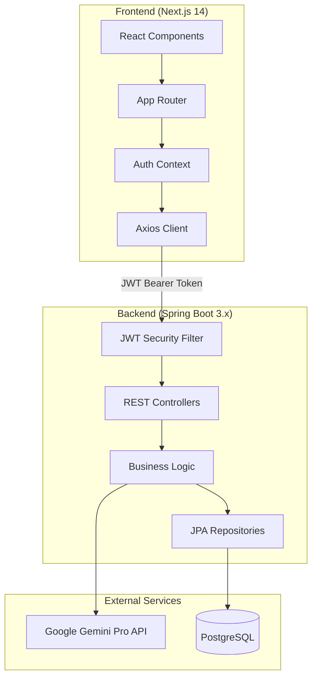
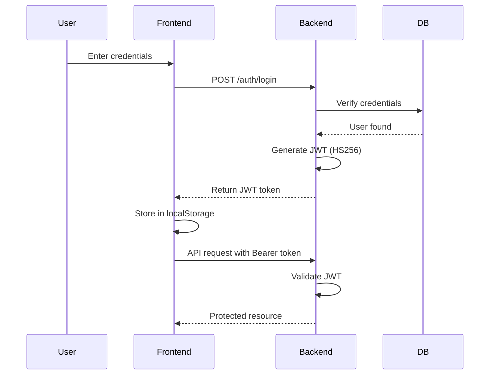
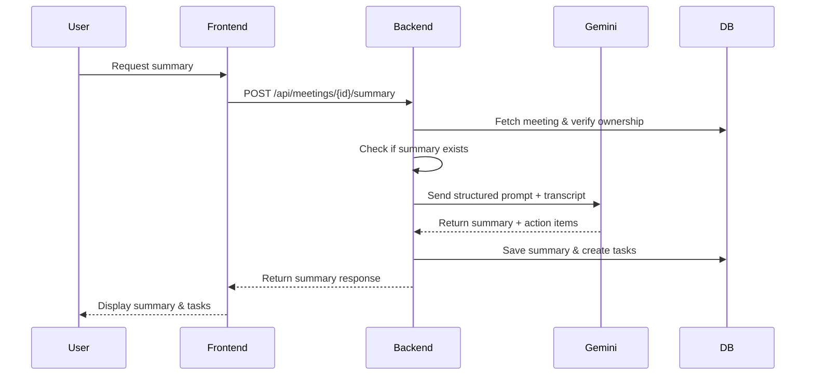

# Design Document: InsightAI Meeting Assistant

## Overview

InsightAI is a full-stack AI-powered meeting assistant built with Spring Boot 3.x backend and Next.js 14 frontend. The system provides secure JWT-based authentication, meeting management with transcript storage, AI-powered summary generation using Google Gemini Pro API, and task tracking capabilities.

The architecture follows a clean separation between backend REST API and frontend SPA, with stateless authentication, role-based access control, and comprehensive error handling. The system is designed for production deployment with PostgreSQL persistence, structured AI prompts for cost control, and audit trails for compliance.

## Architecture

### High-Level Architecture



### Technology Stack

**Backend:**
- Java 17
- Spring Boot 3.x
- Spring Security (JWT-based, stateless)
- Spring Data JPA
- PostgreSQL
- Maven
- RestTemplate for Gemini API calls

**Frontend:**
- Next.js 14 (App Router)
- React 18
- TypeScript
- Tailwind CSS
- shadcn/ui components
- Axios for HTTP requests

### Authentication Flow



### AI Summary Generation Flow



## Components and Interfaces

### Backend Components

#### 1. Security Layer

**JwtTokenProvider**
- Responsibilities: Generate and validate JWT tokens
- Methods:
  - `generateToken(Authentication auth): String` - Creates JWT with user details
  - `validateToken(String token): boolean` - Validates token signature and expiry
  - `getUserIdFromToken(String token): Long` - Extracts user ID from claims
  - `getEmailFromToken(String token): String` - Extracts email from claims

**JwtAuthenticationFilter**
- Responsibilities: Intercept requests and validate JWT
- Methods:
  - `doFilterInternal(HttpServletRequest, HttpServletResponse, FilterChain)` - Extract and validate token from Authorization header

**SecurityConfig**
- Responsibilities: Configure Spring Security
- Configuration:
  - Disable CSRF for REST API
  - Permit `/auth/**` endpoints
  - Secure all other endpoints
  - Register JWT filter
  - Configure BCryptPasswordEncoder
  - Enable CORS for frontend origin

#### 2. Controller Layer

**AuthController**
- Endpoints:
  - `POST /auth/signup` - Register new user
  - `POST /auth/login` - Authenticate and return JWT
  - `GET /auth/me` - Get current user profile (requires JWT)

**MeetingController**
- Endpoints:
  - `POST /api/meetings` - Create new meeting
  - `GET /api/meetings` - List user's meetings (filtered by ownership)
  - `GET /api/meetings/{id}` - Get meeting details (with ownership check)
  - `POST /api/meetings/{id}/summary` - Generate AI summary

**TaskController**
- Endpoints:
  - `GET /api/tasks` - List user's tasks (filtered by ownership/assignment)
  - `PUT /api/tasks/{id}` - Update task status

#### 3. Service Layer

**AuthService**
- Methods:
  - `registerUser(SignupRequest): User` - Create user with hashed password
  - `authenticateUser(LoginRequest): String` - Validate credentials and return JWT
  - `getCurrentUser(String email): User` - Get authenticated user details

**MeetingService**
- Methods:
  - `createMeeting(MeetingRequest, User): Meeting` - Create meeting with ownership
  - `getUserMeetings(User): List<Meeting>` - Get meetings based on role
  - `getMeetingById(Long id, User): Meeting` - Get meeting with authorization check
  - `generateSummary(Long id, User): SummaryResponse` - Generate AI summary with ownership verification

**TaskService**
- Methods:
  - `getUserTasks(User): List<Task>` - Get tasks based on ownership/assignment
  - `updateTaskStatus(Long id, TaskStatus, User): Task` - Update with authorization check

**GeminiService**
- Methods:
  - `generateSummary(String transcript): GeminiResponse` - Call Gemini API with structured prompt
  - `parseActionItems(String aiResponse): List<ActionItem>` - Extract tasks from AI response

#### 4. Repository Layer

**UserRepository extends JpaRepository<User, Long>**
- Methods:
  - `findByEmail(String email): Optional<User>`
  - `existsByEmail(String email): boolean`

**MeetingRepository extends JpaRepository<Meeting, Long>**
- Methods:
  - `findByCreatedBy(User user): List<Meeting>`
  - `findByCreatedByOrCreatedBy_Role(User user, Role role): List<Meeting>`

**TaskRepository extends JpaRepository<Task, Long>**
- Methods:
  - `findByMeeting_CreatedBy(User user): List<Task>`
  - `findByAssignedTo(User user): List<Task>`
  - `findByMeeting_CreatedByOrAssignedTo(User owner, User assigned): List<Task>`

#### 5. Exception Handling

**GlobalExceptionHandler (@ControllerAdvice)**
- Handles:
  - `ValidationException` → 400 Bad Request
  - `AuthenticationException` → 401 Unauthorized
  - `AccessDeniedException` → 403 Forbidden
  - `ResourceNotFoundException` → 404 Not Found
  - `GeminiApiException` → 502 Bad Gateway
  - `Exception` → 500 Internal Server Error
- Returns unified error format:
```json
{
  "timestamp": "2026-01-19T10:30:00Z",
  "status": 400,
  "error": "Bad Request",
  "message": "Descriptive error message",
  "path": "/api/meetings"
}
```

### Frontend Components

#### 1. Authentication Components

**AuthContext**
- Responsibilities: Manage authentication state globally
- State:
  - `user: User | null`
  - `token: string | null`
  - `loading: boolean`
- Methods:
  - `login(email, password): Promise<void>`
  - `signup(fullName, email, password): Promise<void>`
  - `logout(): void`
  - `checkAuth(): Promise<void>`

**ProtectedRoute**
- Responsibilities: Guard routes requiring authentication
- Logic: Redirect to /login if no token in localStorage

#### 2. API Client

**axiosInstance**
- Configuration:
  - Base URL: `http://localhost:8080`
  - Request interceptor: Add `Authorization: Bearer <token>` header
  - Response interceptor: Handle 401 errors and redirect to /login

#### 3. Page Components

**Pages:**
- `/login` - Login form
- `/signup` - Registration form
- `/dashboard` - Overview with stats
- `/meetings` - List all meetings
- `/meetings/[id]` - Meeting details with summary generation
- `/tasks` - Task list with status updates

**UI Components:**
- Loading indicators for async operations
- Empty state messages when no data
- Error toast notifications
- Form validation feedback

## Data Models

### User Entity

```java
@Entity
@Table(name = "users")
public class User {
    @Id
    @GeneratedValue(strategy = GenerationType.IDENTITY)
    private Long id;
    
    @Column(nullable = false)
    private String fullName;
    
    @Column(nullable = false, unique = true)
    private String email;
    
    @Column(nullable = false)
    private String password; // BCrypt hashed
    
    @Enumerated(EnumType.STRING)
    @Column(nullable = false)
    private Role role; // ADMIN, MEMBER
    
    @CreatedDate
    @Column(nullable = false, updatable = false)
    private LocalDateTime createdAt;
    
    @LastModifiedDate
    private LocalDateTime updatedAt;
}
```

### Meeting Entity

```java
@Entity
@Table(name = "meetings")
public class Meeting {
    @Id
    @GeneratedValue(strategy = GenerationType.IDENTITY)
    private Long id;
    
    @Column(nullable = false)
    private String title;
    
    @Column(columnDefinition = "TEXT")
    private String description;
    
    @Column(columnDefinition = "TEXT")
    private String transcript;
    
    @Column(columnDefinition = "TEXT")
    private String summary;
    
    @Column(nullable = false)
    private LocalDateTime meetingDateTime;
    
    @ManyToOne(fetch = FetchType.LAZY)
    @JoinColumn(name = "created_by_id", nullable = false)
    private User createdBy;
    
    @Column
    private Long summaryGeneratedBy; // User ID who triggered AI
    
    @CreatedDate
    @Column(nullable = false, updatable = false)
    private LocalDateTime createdAt;
    
    @LastModifiedDate
    private LocalDateTime updatedAt;
}
```

### Task Entity

```java
@Entity
@Table(name = "tasks")
public class Task {
    @Id
    @GeneratedValue(strategy = GenerationType.IDENTITY)
    private Long id;
    
    @Column(nullable = false)
    private String title;
    
    @Enumerated(EnumType.STRING)
    @Column(nullable = false)
    private TaskStatus status; // TODO, IN_PROGRESS, DONE
    
    @ManyToOne(fetch = FetchType.LAZY)
    @JoinColumn(name = "meeting_id", nullable = false)
    private Meeting meeting;
    
    @ManyToOne(fetch = FetchType.LAZY)
    @JoinColumn(name = "assigned_to_id")
    private User assignedTo;
    
    @CreatedDate
    @Column(nullable = false, updatable = false)
    private LocalDateTime createdAt;
    
    @LastModifiedDate
    private LocalDateTime updatedAt;
}
```

### DTOs

**SignupRequest**
```java
{
    "fullName": "string",
    "email": "string",
    "password": "string"
}
```

**LoginRequest**
```java
{
    "email": "string",
    "password": "string"
}
```

**LoginResponse**
```java
{
    "token": "string",
    "type": "Bearer",
    "id": "long",
    "email": "string",
    "fullName": "string",
    "role": "string"
}
```

**MeetingRequest**
```java
{
    "title": "string",
    "description": "string",
    "transcript": "string",
    "meetingDateTime": "ISO-8601 string"
}
```

**SummaryResponse**
```java
{
    "summary": "string",
    "actionItems": [
        {
            "title": "string",
            "assignedTo": "string",
            "deadline": "string"
        }
    ],
    "tasksCreated": "integer"
}
```

**TaskUpdateRequest**
```java
{
    "status": "TODO | IN_PROGRESS | DONE"
}
```

### Database Schema

```sql
CREATE TABLE users (
    id BIGSERIAL PRIMARY KEY,
    full_name VARCHAR(255) NOT NULL,
    email VARCHAR(255) NOT NULL UNIQUE,
    password VARCHAR(255) NOT NULL,
    role VARCHAR(50) NOT NULL,
    created_at TIMESTAMP NOT NULL,
    updated_at TIMESTAMP
);

CREATE TABLE meetings (
    id BIGSERIAL PRIMARY KEY,
    title VARCHAR(255) NOT NULL,
    description TEXT,
    transcript TEXT,
    summary TEXT,
    meeting_date_time TIMESTAMP NOT NULL,
    created_by_id BIGINT NOT NULL REFERENCES users(id),
    summary_generated_by BIGINT REFERENCES users(id),
    created_at TIMESTAMP NOT NULL,
    updated_at TIMESTAMP
);

CREATE TABLE tasks (
    id BIGSERIAL PRIMARY KEY,
    title VARCHAR(255) NOT NULL,
    status VARCHAR(50) NOT NULL,
    meeting_id BIGINT NOT NULL REFERENCES meetings(id),
    assigned_to_id BIGINT REFERENCES users(id),
    created_at TIMESTAMP NOT NULL,
    updated_at TIMESTAMP
);

CREATE INDEX idx_meetings_created_by ON meetings(created_by_id);
CREATE INDEX idx_tasks_meeting ON tasks(meeting_id);
CREATE INDEX idx_tasks_assigned_to ON tasks(assigned_to_id);
```

## Gemini API Integration

### Structured Prompt Template

```
You are an AI assistant analyzing meeting transcripts. 

Analyze the following meeting transcript and provide:

1. SUMMARY: A concise 2-3 sentence summary of the meeting
2. KEY DECISIONS: Bullet points of important decisions made
3. ACTION ITEMS: List each action item in the format:
   - [Action description] | Owner: [name if mentioned, else "Unassigned"] | Deadline: [date if mentioned, else "Not specified"]

Transcript:
{transcript}

Respond in the following JSON format:
{
  "summary": "string",
  "keyDecisions": ["string"],
  "actionItems": [
    {
      "action": "string",
      "owner": "string",
      "deadline": "string"
    }
  ]
}
```

### Gemini API Configuration

**Endpoint:** `https://generativelanguage.googleapis.com/v1beta/models/gemini-pro:generateContent`

**Request Format:**
```json
{
  "contents": [{
    "parts": [{
      "text": "structured prompt with transcript"
    }]
  }],
  "generationConfig": {
    "temperature": 0.4,
    "maxOutputTokens": 1024
  }
}
```

**Headers:**
- `Content-Type: application/json`
- `x-goog-api-key: {API_KEY}`

### Error Handling

- **Quota Exceeded (429):** Return user-friendly message about rate limits
- **Invalid API Key (401):** Log error and return generic AI service error
- **Timeout:** Retry once, then fail gracefully
- **Invalid Response:** Log raw response and return parsing error

### Cost Safety Measures

1. Check if summary already exists before calling API
2. Require explicit user action for regeneration
3. Validate transcript is not empty before API call
4. Set max token limit to 1024
5. Use temperature 0.4 for consistent, focused responses
6. Log all API calls with timestamp and user ID for audit


## Correctness Properties

*A property is a characteristic or behavior that should hold true across all valid executions of a system—essentially, a formal statement about what the system should do. Properties serve as the bridge between human-readable specifications and machine-verifiable correctness guarantees.*

### Authentication & Security Properties

**Property 1: User registration creates hashed passwords**
*For any* valid registration request with fullName, email, and password, creating a user account should result in a stored password that is BCrypt hashed (not plaintext) and the user should be persisted with the provided details.
**Validates: Requirements 1.1, 1.6**

**Property 2: Duplicate email registration is rejected**
*For any* email address, if a user with that email already exists, attempting to register another user with the same email should fail with an appropriate error message.
**Validates: Requirements 1.2**

**Property 3: Valid credentials return valid JWT**
*For any* registered user, logging in with correct credentials should return a JWT token that is valid, uses HS256 algorithm, and expires in 24 hours.
**Validates: Requirements 1.3, 1.7**

**Property 4: Invalid credentials are rejected**
*For any* login attempt with incorrect email or password, the system should reject authentication and return an error without revealing which field was incorrect.
**Validates: Requirements 1.4**

**Property 5: Valid JWT grants access to protected resources**
*For any* authenticated user with a valid JWT token, requests to protected endpoints with the token in "Bearer <TOKEN>" format should be processed successfully.
**Validates: Requirements 1.5, 5.2**

**Property 6: Invalid or expired JWT returns 401**
*For any* request to a protected endpoint with an expired, malformed, or missing JWT token, the system should return 401 Unauthorized status.
**Validates: Requirements 1.9, 5.3, 5.4**

**Property 7: Public endpoints accessible without authentication**
*For any* request to /auth/signup or /auth/login endpoints, the system should process the request without requiring a JWT token.
**Validates: Requirements 1.8, 5.1**

**Property 8: Stateless authentication**
*For any* sequence of authenticated requests, the system should not maintain session state between requests, relying solely on JWT token validation.
**Validates: Requirements 5.5**

**Property 9: CORS configuration allows frontend**
*For any* cross-origin request from the configured frontend origin, the system should include appropriate CORS headers and allow the request.
**Validates: Requirements 5.7**

### Meeting Management Properties

**Property 10: Meeting creation with ownership**
*For any* authenticated user and valid meeting data (title, description, transcript, meetingDateTime), creating a meeting should persist it with the user as createdBy and return the created meeting.
**Validates: Requirements 2.1**

**Property 11: Meeting list filtered by ownership**
*For any* authenticated non-admin user, requesting all meetings should return only meetings where that user is the creator; for admin users, all meetings should be returned.
**Validates: Requirements 2.2, 11.1**

**Property 12: Meeting retrieval with authorization**
*For any* meeting ID and authenticated user, fetching the meeting should succeed only if the user is the creator or has ADMIN role; otherwise, return 403 Forbidden.
**Validates: Requirements 2.3, 11.2**

**Property 13: Non-existent meeting returns 404**
*For any* meeting ID that does not exist in the database, requesting that meeting should return 404 Not Found status.
**Validates: Requirements 2.4**

**Property 14: Large transcripts are stored**
*For any* meeting with a transcript of significant size (e.g., 10,000+ characters), the system should store the complete transcript without truncation.
**Validates: Requirements 2.5**

**Property 15: Meetings accept null transcripts**
*For any* meeting creation request without a transcript field or with null/empty transcript, the system should accept and persist the meeting.
**Validates: Requirements 2.7**

**Property 16: Automatic timestamp population**
*For any* entity creation or update (User, Meeting, Task), the system should automatically populate createdAt on creation and updatedAt on modification without explicit setting.
**Validates: Requirements 2.6, 14.1**

### AI Summary Generation Properties

**Property 17: Summary generation with valid transcript**
*For any* meeting with a non-empty transcript, requesting summary generation should call Gemini API with the structured prompt, store the returned summary, and create tasks from extracted action items.
**Validates: Requirements 3.1, 3.6**

**Property 18: Summary generation requires transcript**
*For any* meeting without a transcript (null or empty), requesting summary generation should fail with an error indicating transcript is required.
**Validates: Requirements 3.2**

**Property 19: Gemini API errors handled gracefully**
*For any* Gemini API failure (timeout, error response, quota exceeded), the system should return a descriptive error message to the user without crashing.
**Validates: Requirements 3.3, 13.5**

**Property 20: No tasks created when no action items**
*For any* AI response that contains a summary but no action items, the system should store the summary without creating any Task entities.
**Validates: Requirements 3.7**

**Property 21: Structured prompt consistency**
*For any* summary generation request, the system should use the same fixed structured prompt template that requests summary, key decisions, and action items in JSON format.
**Validates: Requirements 13.1**

**Property 22: Summary generation idempotency**
*For any* meeting that already has a summary, requesting summary generation again should be prevented by default unless explicit regeneration flag is provided.
**Validates: Requirements 13.3, 13.4**

**Property 23: Summary generation audit trail**
*For any* successful summary generation, the system should record the user ID who triggered the generation in the summaryGeneratedBy field.
**Validates: Requirements 14.2**

### Task Management Properties

**Property 24: Task list filtered by ownership and assignment**
*For any* authenticated user, requesting all tasks should return only tasks where the user is either the creator of the associated meeting or the assignedTo user.
**Validates: Requirements 4.1, 11.3**

**Property 25: Task status update**
*For any* task and valid status value (TODO, IN_PROGRESS, DONE), updating the task status should persist the change and return the updated task.
**Validates: Requirements 4.2**

**Property 26: Invalid task status rejected**
*For any* task update request with a status value not in (TODO, IN_PROGRESS, DONE), the system should reject the update with a validation error.
**Validates: Requirements 4.3**

**Property 27: Task-meeting association required**
*For any* task, it should always be associated with exactly one meeting via the meeting field (not null).
**Validates: Requirements 4.4**

**Property 28: Task assignment is optional**
*For any* task creation, the assignedTo field should be optional, allowing tasks to be created without an assigned user.
**Validates: Requirements 4.6**

### Authorization & Access Control Properties

**Property 29: Unauthorized access returns 403**
*For any* authenticated non-admin user attempting to access a meeting or task they don't own or aren't assigned to, the system should return 403 Forbidden.
**Validates: Requirements 11.4**

### Error Handling Properties

**Property 30: Unified error response format**
*For any* error condition (validation, authentication, authorization, not found, server error), the system should return a JSON response with timestamp, status, error, message, and path fields.
**Validates: Requirements 9.4, 12.2**

**Property 31: Comprehensive error handling**
*For any* error type (validation, authentication, authorization, not found, AI API failure, database error), the global exception handler should catch and format the error appropriately.
**Validates: Requirements 12.3**

**Property 32: Error logging**
*For any* error that occurs, the system should log the error with appropriate log level (WARN for client errors, ERROR for server errors).
**Validates: Requirements 12.4**

**Property 33: HTTP status code semantics**
*For any* API operation, the system should return appropriate HTTP status codes: 200 OK for successful reads, 201 Created for resource creation, 400 Bad Request for validation errors, 401 Unauthorized for authentication failures, 403 Forbidden for authorization failures, and 404 Not Found for missing resources.
**Validates: Requirements 9.5**

### Frontend Properties

**Property 34: JWT storage in localStorage**
*For any* successful login, the frontend should store the received JWT token in localStorage under a consistent key.
**Validates: Requirements 6.2**

**Property 35: Protected route redirection**
*For any* attempt to access a protected page without a valid JWT token in localStorage, the frontend should redirect to /login.
**Validates: Requirements 6.3**

**Property 36: Axios interceptor adds JWT**
*For any* API request made through the Axios client, the request should automatically include the JWT token from localStorage in the Authorization header as "Bearer <TOKEN>".
**Validates: Requirements 6.4**

**Property 37: 401 response triggers re-authentication**
*For any* API response with 401 Unauthorized status, the frontend should redirect the user to /login and clear the stored token.
**Validates: Requirements 6.5**

**Property 38: Loading indicators during async operations**
*For any* asynchronous operation (API call, AI summary generation), the frontend should display a loading indicator until the operation completes.
**Validates: Requirements 15.1**

**Property 39: Empty state messages**
*For any* list view (meetings, tasks) with no data, the frontend should display a clear empty state message explaining the absence of data.
**Validates: Requirements 15.2**

**Property 40: User-friendly error display**
*For any* error response from the backend, the frontend should display a user-friendly error message (not raw technical details).
**Validates: Requirements 15.3**

### Integration Properties

**Property 41: End-to-end workflow**
*For any* user, the complete workflow of signup → login → create meeting → generate summary → view tasks should execute successfully with proper data flow and authorization at each step.
**Validates: Requirements 9.3**

## Error Handling

### Backend Error Strategy

The system implements a comprehensive error handling strategy using Spring's `@ControllerAdvice`:

**Exception Hierarchy:**
```
CustomException (base)
├── ValidationException (400)
├── AuthenticationException (401)
├── AuthorizationException (403)
├── ResourceNotFoundException (404)
├── GeminiApiException (502)
└── DatabaseException (500)
```

**Error Response Format:**
```json
{
  "timestamp": "2026-01-19T10:30:00Z",
  "status": 400,
  "error": "Bad Request",
  "message": "Email already exists",
  "path": "/auth/signup"
}
```

**Logging Strategy:**
- Client errors (4xx): WARN level with request details
- Server errors (5xx): ERROR level with full stack trace
- Authentication failures: INFO level for security monitoring
- AI API calls: DEBUG level with request/response

### Frontend Error Strategy

**Error Display:**
- Toast notifications for transient errors
- Inline form validation for input errors
- Error pages for critical failures (500, 503)
- Retry buttons for recoverable errors

**Error Recovery:**
- Automatic retry for network timeouts (max 2 attempts)
- Token refresh on 401 (redirect to login)
- Graceful degradation for non-critical features

## Testing Strategy

### Backend Testing

**Unit Tests:**
- Service layer business logic
- JWT token generation and validation
- Password hashing and verification
- DTO validation
- Error handling edge cases

**Property-Based Tests:**
- All properties listed in Correctness Properties section
- Minimum 100 iterations per property test
- Use JUnit 5 with jqwik library for property-based testing
- Each test tagged with: `@Tag("Feature: ai-meeting-assistant, Property N: [property text]")`

**Integration Tests:**
- Controller endpoints with MockMvc
- Database operations with @DataJpaTest
- Security configuration with @SpringBootTest
- Gemini API integration with WireMock

**Test Configuration:**
```java
@PropertyTest
@Tag("Feature: ai-meeting-assistant, Property 1: User registration creates hashed passwords")
void testUserRegistrationHashesPasswords(@ForAll("validSignupRequests") SignupRequest request) {
    // Test implementation
}
```

### Frontend Testing

**Unit Tests:**
- Component rendering with React Testing Library
- Utility functions
- Form validation logic
- State management

**Property-Based Tests:**
- Form input validation across random inputs
- API client request formatting
- Token storage and retrieval
- Use fast-check library for property-based testing

**Integration Tests:**
- Page navigation flows
- API integration with MSW (Mock Service Worker)
- Authentication flow end-to-end
- Error handling scenarios

**E2E Tests:**
- Complete user workflows with Playwright
- Cross-browser compatibility
- Responsive design validation

### Test Data Strategy

**Generators for Property Tests:**
- Valid user data: random names, emails, passwords
- Valid meeting data: random titles, descriptions, transcripts, dates
- Valid task data: random titles, statuses
- Invalid data: edge cases, boundary values, malformed inputs
- JWT tokens: valid, expired, malformed, missing

**Test Database:**
- Use Testcontainers for PostgreSQL in integration tests
- H2 in-memory database for unit tests
- Separate test schema with automatic cleanup

### Testing Tools

**Backend:**
- JUnit 5
- jqwik (property-based testing)
- Mockito (mocking)
- MockMvc (controller testing)
- Testcontainers (database testing)
- WireMock (external API mocking)

**Frontend:**
- Jest
- React Testing Library
- fast-check (property-based testing)
- MSW (API mocking)
- Playwright (E2E testing)

### CI/CD Testing

**Pipeline Stages:**
1. Unit tests (fast feedback)
2. Property-based tests (comprehensive coverage)
3. Integration tests (component interaction)
4. E2E tests (user workflows)
5. Security scanning (dependency vulnerabilities)
6. Code coverage reporting (minimum 80%)

**Test Execution:**
- Unit + Property tests: Run on every commit
- Integration tests: Run on pull requests
- E2E tests: Run on main branch and before deployment
- Performance tests: Run nightly

